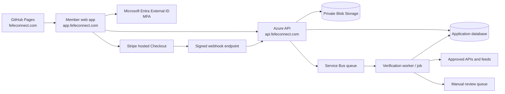

# Verification service architecture

This is the implementation handoff for the first backend. The public GitHub Pages site remains a static landing page; authentication, subscriptions, applications, uploads, review, and verification live in Azure.

## Recommended boundary

Suggested Azure services:

- Entra External ID for customer authentication and MFA;
- Azure Container Apps for the API and background worker, with a scheduled Container Apps Job for rechecks;
- Azure Database for PostgreSQL Flexible Server or Azure SQL for transactional records;
- Azure Service Bus for durable verification and notification work;
- private Azure Blob Storage for permitted uploads and evidence objects;
- Azure Key Vault plus managed identities for secrets and service access;
- Application Insights for redacted operational telemetry; and
- Defender for Storage malware scanning on applicant uploads.

The first release can combine the API and worker deployment while keeping their identities, queues, and code paths logically distinct. Do not put source credentials or Stripe secrets in GitHub Pages, browser JavaScript, or the repository.

## API surface

All routes except the Stripe webhook and published-profile read require an Entra access token. Authorization is enforced server-side.

| Method and route | Caller | Purpose |
|---|---|---|
| `POST /v1/billing/checkout-sessions` | Approved applicant | Recheck server-side approval, map a public plan key to a private Stripe Price ID, append the recurring-billing disclosure acceptance, and create hosted Stripe Checkout. |
| `POST /v1/webhooks/stripe` | Stripe | Verify the Stripe signature and idempotently update subscription state. |
| `POST /v1/applications` | Applicant | Create one legal or healthcare application. |
| `GET /v1/applications/{id}` | Owner/reviewer | Read an authorized view of the application and its status. |
| `PATCH /v1/applications/{id}` | Owner before submission | Save validated draft fields. |
| `POST /v1/applications/{id}/submit` | Owner | Freeze the submitted version, append the separate policy acceptances and attestation, and enqueue checks. |
| `POST /v1/uploads` | Applicant | Request a narrowly scoped upload grant for an allowed type and size. |
| `GET /v1/verifications/{id}` | Owner/reviewer | Return an audience-filtered normalized result; never return raw evidence to applicants by default. |
| `GET /v1/reviews` | Reviewer | List assigned/manual-review work. |
| `POST /v1/reviews/{id}/decisions` | Reviewer | Record a versioned decision and reason codes. |
| `POST /v1/applications/{id}/recheck` | Compliance admin/system job | Enqueue an authorized recheck. |
| `GET /v1/public/profiles/{slug}` | Public | Return only approved published fields and current badge facts. |

Every mutation accepts an idempotency key. Every response carries a request/correlation ID. Browser clients receive stable error codes without regulator raw data or internal review notes.

## Core records

| Record | Important fields and boundary |
|---|---|
| `Account` | Internal ID, Entra subject/tenant, MFA/account flags, roles. No professional truth claims. |
| `Application` | Track, version, lifecycle state, submitted snapshot, attestation version/time. |
| `ProfessionalCredential` | One claimed bar admission or healthcare licence per row, exact jurisdiction and submitted identifier. |
| `Organization` | Claimed firm/practice name, formation jurisdiction, entity identifier, website. |
| `AffiliationClaim` | Applicant, organization, role, evidence references, confirmation state. |
| `ServiceJurisdiction` | Proposed country/state and service mode; never inferred from address. |
| `Subscription` | Stripe customer/subscription IDs and webhook-derived state. No card data. |
| `ConsentAcceptance` | One append-only event per terms/privacy/intended-use/verification/billing disclosure, including version, canonical-text hash, Entra subject, server time, and billing terms where applicable. |
| `VerificationAttempt` | Claim, authority, query mode, timestamps, adapter/rules versions, technical outcome. |
| `VerificationDecision` | Normalized status, reason codes, reviewer/rule identity, validity window, public claim. Append new decisions rather than overwriting history. |
| `EvidenceObject` | Private blob reference, content type, size, SHA-256, source/retention class, access audit. |
| `Profile` | Applicant-approved display content plus separately resolved, current public check facts. |
| `AuditEvent` | Actor, action, target, time, correlation ID, and security metadata; no full source payloads in logs. |

Use database constraints so one decision cannot silently cover multiple jurisdictions or credentials. Encrypt transport and storage, use row-level authorization in the service, and keep evidence access more restrictive than ordinary application access.

## Application states

`draft` → `submitted` → `checks_running` → `manual_review` → `approved` or `not_approved`

An approved application then follows `activation_pending` → `checkout_pending` → `active`. Only a verified Stripe webhook may move a membership to `active`; a browser redirect never does.

Additional states:

- `changes_requested` returns to an editable, versioned application;
- `source_delayed` means no adverse conclusion was reached;
- `withdrawn` is applicant-initiated;
- `suspended` controls platform access without rewriting the verification history; and
- `expired` removes the public check until re-verification.

Application approval is an aggregate membership decision. It must retain links to the individual credential, entity, affiliation, and corroboration decisions that supported it.

## Stripe rules

- Use Stripe Checkout and Billing for FEFE’s own membership subscriptions.
- Use Stripe Connect only if FEFE later routes money to members; ordinary subscription collection does not need Connect.
- Do not create a Checkout Session until the authenticated application is approved. The browser submits only a stable plan key; the server owns the Stripe Price ID and price mapping.
- Treat `invoice.paid` and other verified webhook events as the source of billing truth.
- Verify webhook signatures against the raw request body, reject old/replayed events according to Stripe guidance, and store event IDs for idempotency.
- Do not store card numbers or sensitive payment-method data.
- Verification and the membership decision occur before payment. Declined applicants are not charged; activated subscriptions follow the disclosed cancellation and refund terms.

## Upload rules

Allow only documented file types and small maximum sizes. The API creates a private object key unrelated to the original filename and, when direct upload is used, grants a short-lived user-delegation SAS restricted to that one object. Quarantine the object until type/signature validation and malware scanning pass. Strip image metadata before a profile photo becomes public.

Do not request professional-source screenshots from applicants when FEFE can perform the official lookup itself. Applicant documents are supporting evidence, never a replacement for a required primary-source result.

## Operational controls

- Separate applicant, member, reviewer, compliance-admin, support, and operator permissions.
- Require MFA for reviewers and administrators; consider stronger phishing-resistant methods for privileged roles.
- Use managed identity between Azure resources and keep secrets in Key Vault.
- Redact names, emails, phone numbers, licence numbers, Stripe payloads, and source responses from ordinary logs.
- Rate-limit public and authenticated endpoints; add bot and abuse controls to application creation.
- Use a dead-letter queue and alert on adapter errors, unknown source statuses, stale checks, and repeated webhook failures.
- Maintain a per-adapter kill switch so a source or terms change can stop new checks without taking down applications.
- Back up the transactional database, test restore, and document incident response and breach-notification ownership.
- Support data access, correction, deletion, consent, and retention workflows appropriate to each market before admitting that market.

## Build sequence and gates

1. **Policy gate** — counsel reviews Georgia entity language, membership/referral model, public claims, refunds, privacy, international availability, and source permissions.
2. **Contracts** — finalize onboarding JSON Schemas, database migrations, result schema, reason codes, and fixture tests.
3. **Identity and roles** — configure Entra External ID, MFA, API token validation, reviewer/admin roles, and audit events.
4. **Applications and private uploads** — implement both track payloads, attestation versioning, Blob quarantine/scanning, and access tests.
5. **Billing** — implement approved-applicant Checkout, server-owned price mapping, signed idempotent webhooks, subscription state, and test-clock scenarios.
6. **Manual-first verification** — ship reviewer queues for Georgia legal, Georgia healthcare, entity, and affiliation checks using approved individual sources.
7. **NPPES adapter** — implement the official API 2.1 adapter as corroboration, with fixtures for exact, missing, multiple, mismatch, rate-limit, and outage cases.
8. **Approved feeds** — request Georgia healthcare roster access and State Bar permission/feed options; automate only after terms and field mappings are approved.
9. **Profiles and badge** — publish the minimum claim, source label, date, expiry, and disclosure; automatically remove stale checks.
10. **Jurisdiction expansion** — repeat the source-onboarding packet, legal/privacy gate, test suite, and operations approval for every new state or country.

The implementation is ready to begin when steps 1 and 2 have named owners and written acceptance criteria. The initial live workflow can operate with human primary-source review while permitted API adapters are added deliberately.
